# LVGL_learn
LVGL学习
基于CodeBlocks的LVGL学习例程

[CodeBlocks下载 (20.03-mingw)](https://www.codeblocks.org/downloads/)

## 0.lv_port_win_codeblocks-master
LVGL综合例程
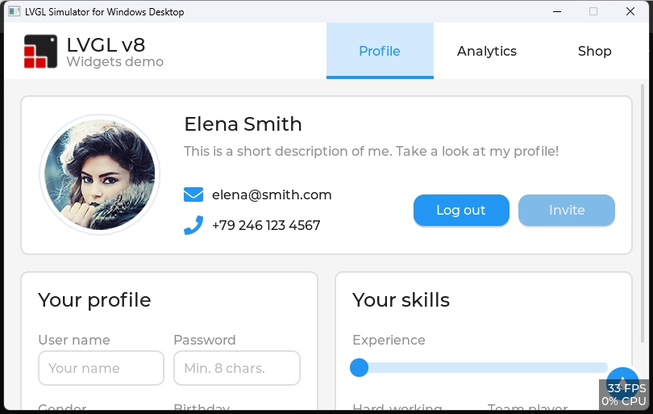  
## 1.lv_obj
LVGL布局例程
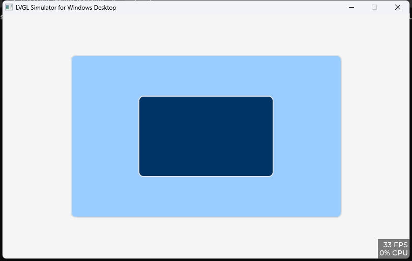  

## 2.lv_arc
LVGL圆弧例程
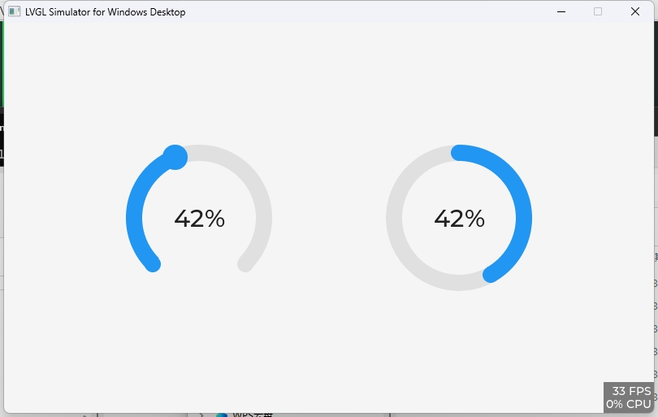  

## 3.lv_bar
LVGL进度条例程
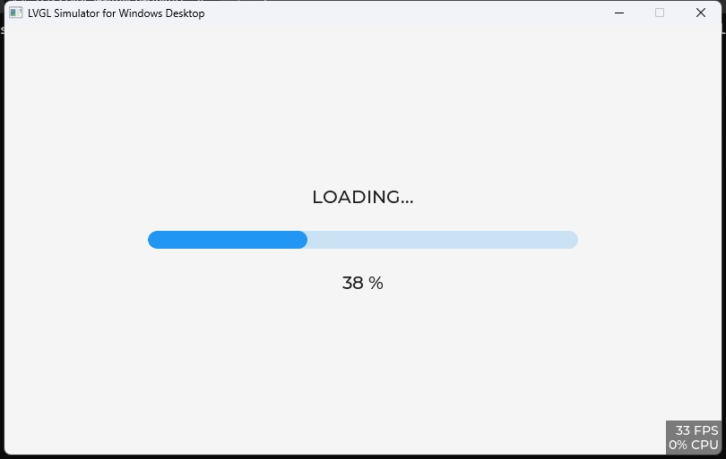  

## 4.lv_btn
LVGL按钮例程
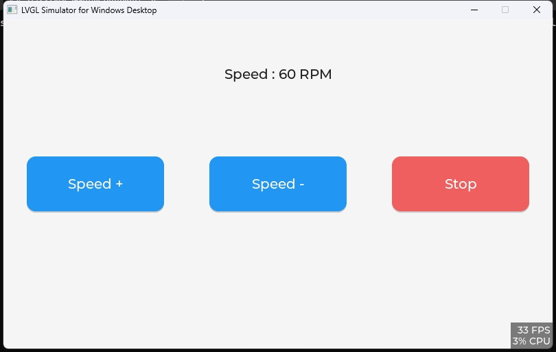  

## 5.lv_label
LVGL标签例程
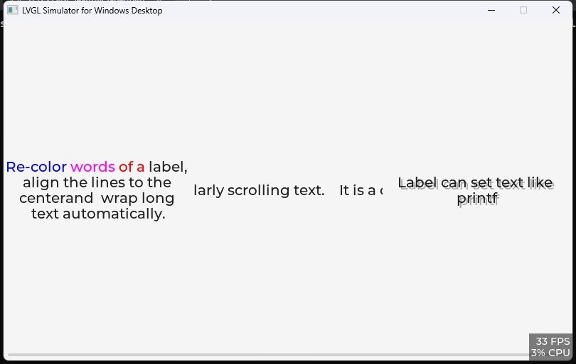  

## 6.lv_btn_matrix
LVGL矩阵按钮例程

[LVGL图片转C数组工具](https://lvgl.io/tools/imageconverter)

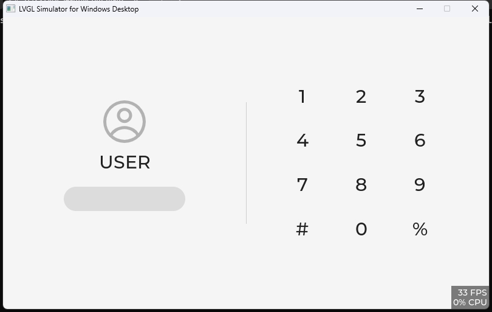  

## 7.lv_checkbox
LVGL复选框例程
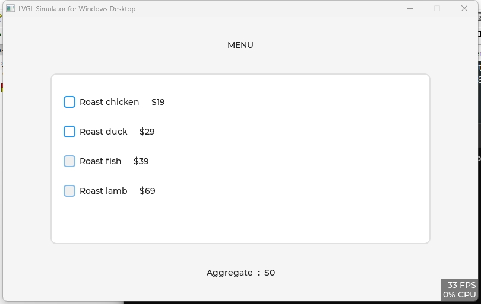  

## 8.lv_dopdown
LVGL下拉列表例程
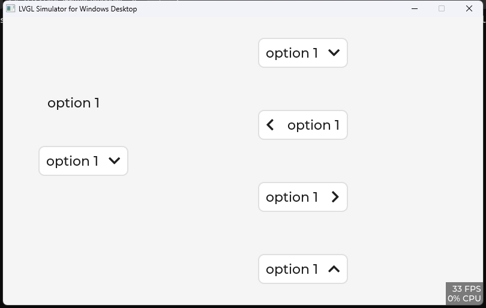  

## 9.lv_slider
LVGL滑块例程
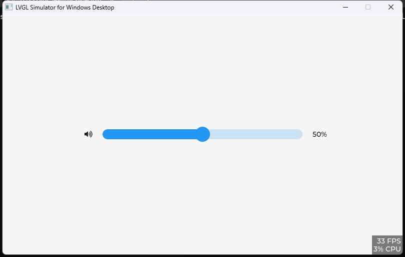  

## 10.lv_switch
LVGL开关例程
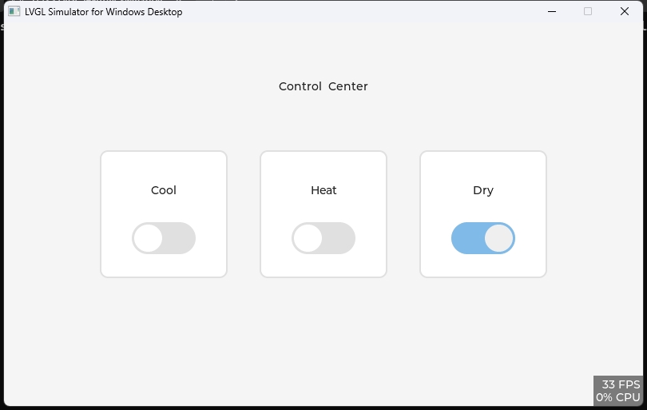  

## 11.lv_roller
LVGL滚轮例程
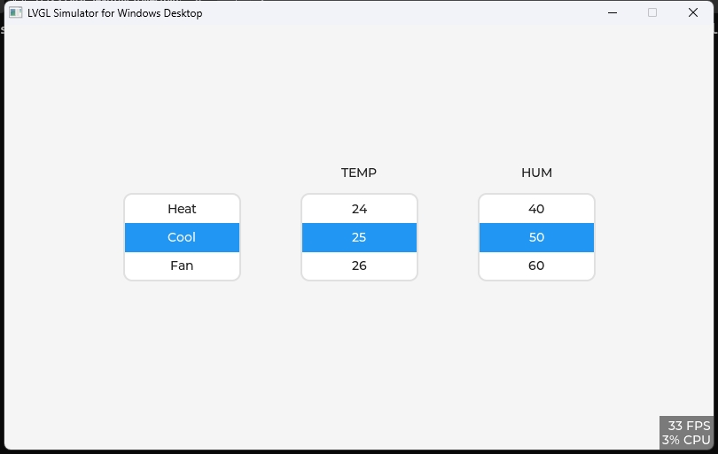  

## 12.lv_img
LVGL图片例程
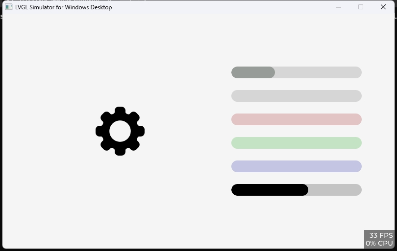 

## 13.lv_tabview
LVGL选项卡例程
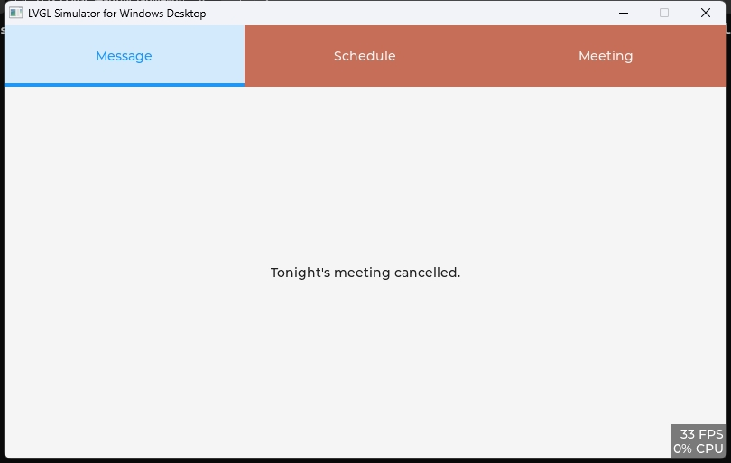 

## 14.lv_led
LVGL led灯例程
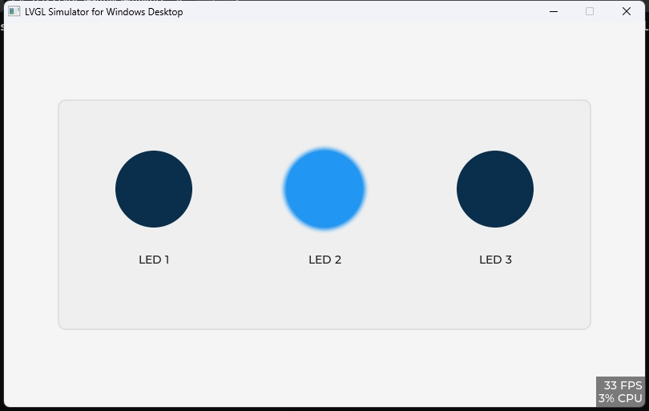 

## 15.lv_keyboard
LVGL键盘例程
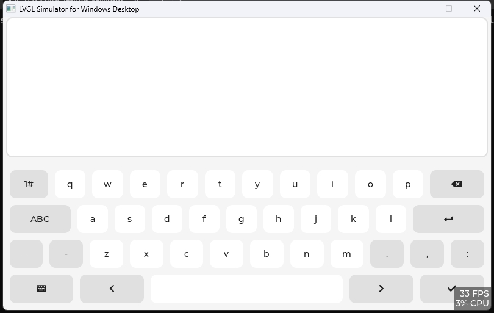 

## 16.lv_txtarea
LVGL文本框输入例程
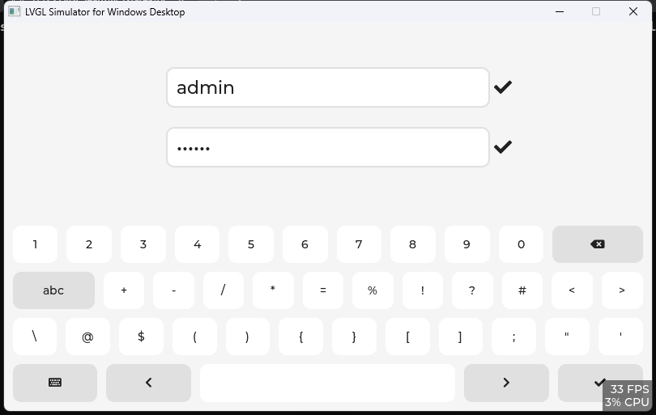 

## 17.lv_msgbox
LVGL消息框提示例程
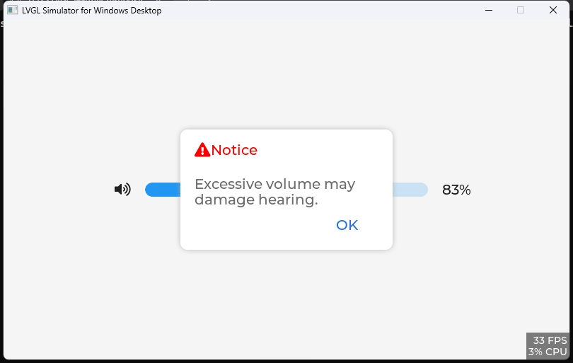 

## 18.lv_imgbtn
LVGL图片按钮例程
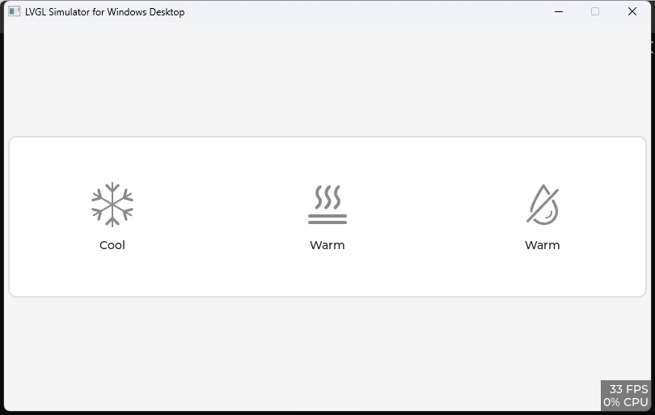 

## 19.lv_list
LVGL列表例程
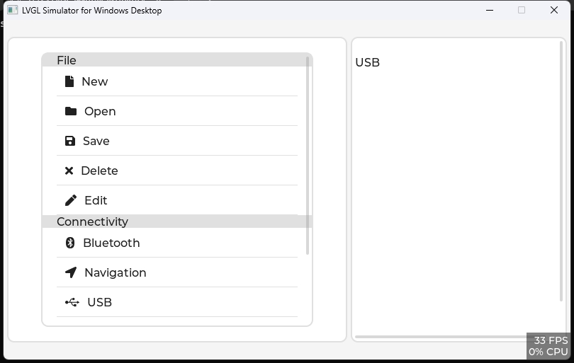 

## 20.lv_imgbtn
LVGL列表例程